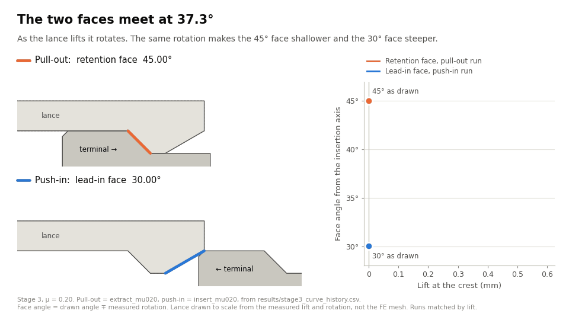
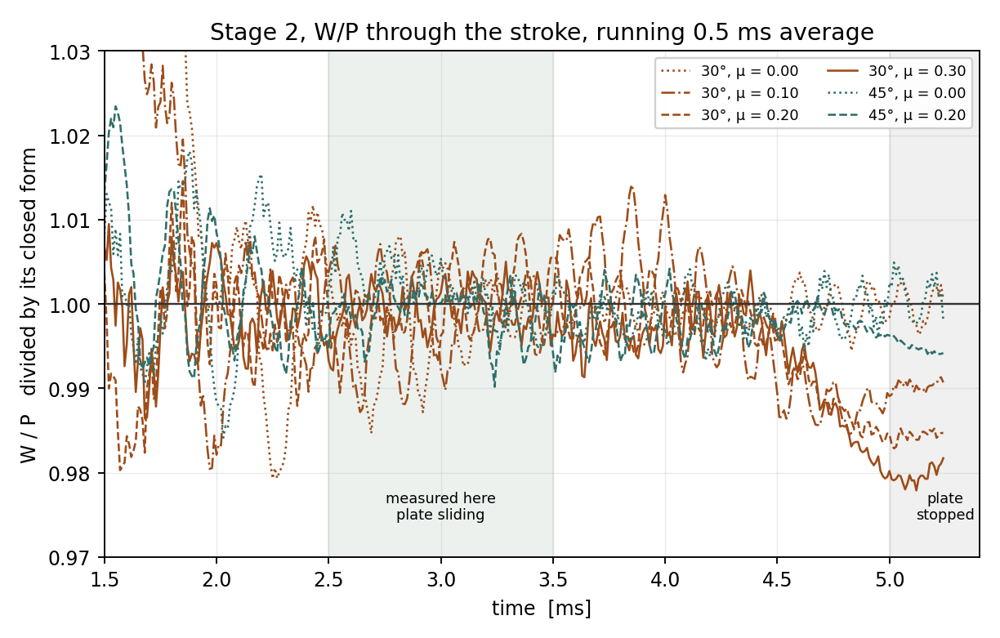
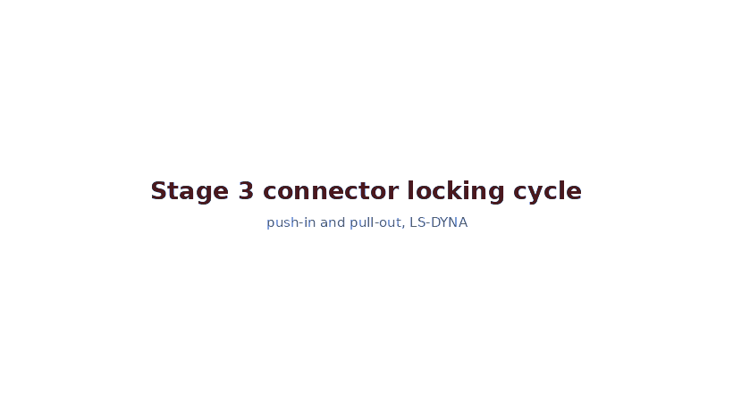
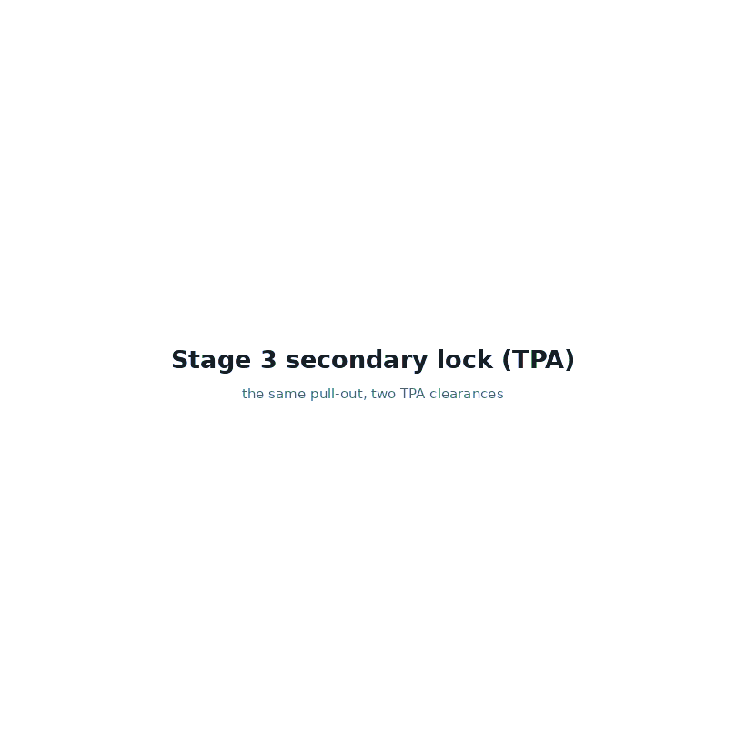

# Connector Lance & TPA Study

A staged FE verification study of a plastic connector locking system — terminal, locking
lance, and secondary lock (TPA) — built so that **every added physical effect is verified
before the next one is introduced**.

**Status: all three stages complete.** Stage 3 confirms, from displacement measurements
alone, that the lance's own rotation brings a 45° retention face and a 30° lead-in to the
same 37.3° effective angle — 0.13° of spread across six runs, 1.2 % from a value written
before the models were built. Getting a usable *force* measurement out of the same runs
took three output rates and two corrections to the estimator, written up under
[Stage 3 results](#stage-3-results).

Stage 2 matches the closed-form wedge relation to within 0.41 % across both ramp angles
and a friction sweep to µ = 0.30. Stage 3 predicted, from those two stages alone and
before any deck was written, that the lance's rotation would collapse the designed
30°/45° asymmetry — and then measured the rotation behind it on both faces.



*Both runs, matched by lift, from the committed CSVs. Made by [`scripts/animate_stage3.py`](scripts/animate_stage3.py).*

---

## The engineering question

A connector terminal is held in its cavity by a thin flexible plastic finger: the
**lance**. The lance is a flexible feature, and long-term material behaviour can reduce
its effective load-carrying capability. So a second part — the **TPA** (Terminal Position
Assurance) — is inserted afterwards to block the lance from deflecting, and the terminal
can no longer escape.

> **How does a connector locking feature behave when it stops being a simple bending
> problem and becomes a contact and friction problem — and what does the secondary lock
> actually change about the load path?**

---

## Method

Three stages. Each adds exactly one new piece of physics, and each is checked against
something independent before the next is added.

| Stage | Physics added | Checked against |
|---|---|---|
| **1 · Structural verification** | bending only, no contact | closed-form cantilever solution |
| **2 · Contact mechanics** | contact and friction | wedge relation, checked on W/P — a ratio with no stiffness in it |
| **3 · Functional retention** | the locking tooth, the terminal and the TPA | Stage 1 × Stage 2 — the lance stiffness times the wedge relation, predicted before the runs |

Stage 3 has no closed form of its own, and does not need one: its prediction is the
product of the two stages already verified. That is the whole reason for building in this
order. It is also where the idealisations start to cost something, and Stage 3's job is to
say how much — the tooth stiffens the lance, the load moves off the tip, and the inclined
faces now sit on a part that rotates.

The analytical reference is committed **before any FE model is built**, so the expected
values are a prediction rather than a description of results already obtained. The closed
form is not a solver and cannot share a solver's mistakes. A second FE code was considered
and deliberately left out: it would have cost days of unfamiliar tooling to give a second
opinion on a question the analytical solution already answers.

---

## Analytical targets

Computed by [`scripts/analytical.py`](scripts/analytical.py). Nothing is hard-coded; the script re-derives every
quantity by a second independent route and raises if the two disagree.

| Quantity | Value |
|---|---|
| Euler–Bernoulli tip force | 3.6750 N |
| **Timoshenko tip force — analytical reference** | **3.6455 N** |
| Shear correction (κ = 5/6) | 0.8100 % |
| Root strain | 1.1250 % (75 % of permissible) |
| First bending mode | 5,110 Hz |
| Insertion force, µ = 0 | 2.1218 N |
| Retention force, µ = 0 | 3.6750 N — returns P exactly |

```
python scripts/analytical.py
python scripts/make_stage1_models.py
python scripts/postprocess_stage1.py
```

---

## Stage 1 finding: how the tip deflection is applied

The obvious way to impose a tip deflection on a solid model is to prescribe the same z
displacement at every node of the tip face. On this geometry that is wrong, and the reason
is geometric rather than numerical.

At a tip deflection of 0.6 mm on an 8 mm cantilever, the tip section rotates **6.4°**. A
plane section rotated by θ projects shorter onto the z axis by t(1 − cos θ). Holding every
node of that face at the same z forbids the projection change, so the material has to
stretch instead:

> **ε_zz = θ² / 2 = 0.63 %**

against a root bending strain of 1.125 %. An artificial through-thickness strain worth
more than half the peak design strain of the model, injected at the tip, and paid for in
reaction force. On the n4 mesh it costs about **7 %**.

The model therefore ties the tip face into a rigid section and prescribes the deflection
at a control node on the neutral axis, with all rotations free. This is Euler–Bernoulli's
"plane sections remain plane" written as a constraint — the FE model is made to adopt the
assumption the closed form is built on, which is the point of a verification study.

The effect scales as θ², so it is invisible at small deflections and grows quickly. Here
δ/L = 0.075, which is where it stops being negligible.

**Two other explanations were tested first and set aside:**

| Hypothesis | Test | What the data shows |
|---|---|---|
| Element formulation — shear locking was the initial suspicion | ELFORM −1, 1 and 2 on a common mesh | 0.75 % spread. Formulation sensitivity is small, so the formulation choice is not driving the result. |
| Over-constrained root clamp | lateral DOF released on the root face, one node held to prevent drift | no measurable change in tip force |

---

## Stage 1 results

> **The mesh sequence settles at 3.7809 N, and the result is insensitive to element
> formulation within 0.75 %. The converged 3D solution sits +3.71 % above the idealized
> Timoshenko reference.**

Tip force at a prescribed deflection of 0.600 mm. The control node reads −0.600 mm on
every run, checked before any force was recorded.

| Mesh | h [mm] | Force [N] | Δ vs Timoshenko |
|---|---|---|---|
| n1 | 0.800 | 3.0285 | −16.93 % |
| n2 | 0.400 | 3.8086 | +4.47 % |
| n4 | 0.200 | 3.7975 | +4.17 % |
| **n8** | **0.100** | **3.7809** | **+3.71 %** |

n1 is outside the asymptotic range — one linear element through the thickness carries
constant transverse shear and cannot represent the parabolic distribution — and is
excluded from the fit.

Element formulation on the common mesh (n4):

| Formulation | Force [N] | Δ vs Timoshenko |
|---|---|---|
| ELFORM 1 — one-point, hourglass IHQ 6 / QM 1.0 | 3.7917 | +4.01 % |
| ELFORM −1 — fully integrated, poor-aspect-ratio form | 3.7975 | +4.17 % |
| ELFORM 2 — fully integrated | 3.8202 | +4.79 % |

**Maximum formulation spread: 0.75 %.** Under-integrated softest, fully integrated
stiffest — the ordering element theory predicts, and small enough that the formulation
choice is not driving the result.

**Solution quality.** Kinetic over internal energy peaks at 0.008 % during the ramp.
Hourglass energy on ELFORM 1 is 0.069 % of internal, against a 10 % screening criterion.
Reaction force drifts by at most 0.03 % across the hold, so the response has settled.

**Convergence.** The three-mesh Richardson fit does not hold: the differences grow under
refinement (−0.0111 N then −0.0166 N) instead of shrinking, so at least one mesh is not
demonstrably in the asymptotic range. No observed order and no extrapolation are reported.

> Estimated discretization uncertainty: **≈ 0.55 %** (GCI on the two finest meshes,
> **assuming p = 1**. The observed convergence order was not used, because the meshes were
> not demonstrably in the asymptotic range.)

A likely reason the sequence is not a clean power law: the tip constraint is applied on a
face whose own discretization changes with the mesh, so refinement is not varying
discretization alone.

### Numerical sensitivity and model form are separate quantities

| | |
|---|---|
| Element formulation spread | 0.75 % |
| Estimated discretization uncertainty (assumed p = 1) | ≈ 0.55 % |
| **Deviation from the analytical reference** | **3.71 %** |

The numerical sensitivity of the model is several times smaller than its distance from the
closed form. **What separates the two is model form, not numerics.**

The remaining deviation is consistent with geometric non-linearity, finite-width
three-dimensional effects, and residual discretization uncertainty. Approximate sensitivity
estimates indicate contributions of the order of **1 %**, **2 %** and **< 1 %**
respectively. These are interpretive estimates of the individual mechanisms, not an exact
error budget — the effects are not independent and are not claimed to sum to the total.

Two of them are checked against evidence outside the force comparison. The finite-width
term places the result **20.6 %** of the way from narrow-beam behaviour (modulus E) to
plate behaviour (E/(1−ν²)), which for b/t = 3.1 is the expected region. The geometric term
rests on a tip run-in of 0.027 mm predicted from the slope field, which matches the tip
x-displacement in `nodout` once the +0.045 mm rotation term is removed.

The closed form is therefore used as a bracket as well as a reference: a section of this
aspect ratio should lie between the narrow-beam value (3.6455 N) and the plate-modulus
value (4.1544 N). The finest mesh lies at 27 % of that interval.

**On the initial benchmark.** A ±2 % acceptance band (3.5726 – 3.7184 N) was defined
against the Timoshenko value before any model was run. **It was not met.** It is kept on
record rather than redrawn, and it is not used as a pass/fail criterion in the figures: it
tests a 3D geometrically non-linear solid against a 1D small-displacement solution, and
once the two are known not to be the same problem, the informative measures are the
convergence behaviour, the formulation sensitivity, and the deviation interpreted above.

### Conclusion

> Stage 1 demonstrates a numerically stable LS-DYNA solid model for the prescribed
> cantilever deformation. The solution converges toward approximately 3.78 N, with less
> than 1 % sensitivity to element formulation and low dynamic, hourglass and settling
> contributions. The converged 3D result differs by approximately 3.7 % from the idealized
> Timoshenko reference. This deviation is interpreted as a model-form difference associated
> with the three-dimensional geometry and non-linear deformation, rather than as numerical
> instability.

---

## Stage 2: contact, and why the check is a ratio

The Stage 1 lance, unchanged — same geometry, material, mesh and root clamp, generated by
importing the Stage 1 generator so it cannot drift. What is added is a rigid plate above the
tip with an inclined lower face, driven along −x. Advancing by s lowers the face at the tip
by s·tan α, so the plate deflects the lance with nothing prescribed on the lance at all.

The inclination sits on the **rigid** body on purpose. Contact is on the lance's tip edge,
so the contact normal is the plate's normal — and the plate does not rotate. Put the wedge
face on the lance and the 6.4° tip rotation from Stage 1 would tilt the normal with it; at
30° that is a 28 % error in tan α. The same rotation that broke Stage 1's boundary condition
would have broken Stage 2's reference.

The comparison is on a ratio:

> **W/P = (tan α + µ) / (1 − µ tan α)**

W is the summed axial reaction at the root, P the summed transverse one, both from `spcforc`
at the same instant. Global equilibrium makes them the two components of the contact force,
so the relation follows from the contact normal and the friction law alone.

**The ratio holds no stiffness** — not E, not I, not the deflection. The Stage 1 difference
from beam theory is a stiffness difference, so it cancels out of this comparison exactly.
Stage 1 can sit 3.7 % above beam theory and Stage 2 can still be exact; both are true at
once. That is what the staged structure was built for.

| α | µ | W/P target |
|---|---|---|
| 30° | 0 | 0.5774 |
| 30° | 0.10 / 0.20 / 0.30 | 0.7189 / 0.8788 / 1.0611 |
| **45°** | **0** | **1.0000** |
| 45° | 0.20 | 1.5000 |

The 45° frictionless case is the regression test. Nothing but the contact normal sets it —
no friction, no stiffness, no material. It gets run first: if it is wrong, the contact is
wrong and no other number in the stage is safe.

### Stage 2 results

| case | α | µ | W [N] | P [N] | W/P | closed form | deviation |
|---|---|---|---|---|---|---|---|
| a30_mu000 | 30° | 0 | 1.4847 | 2.5753 | 0.5765 | 0.5774 | −0.14 % |
| a30_mu010 | 30° | 0.10 | 1.8653 | 2.5843 | 0.7218 | 0.7189 | +0.41 % |
| a30_mu020 | 30° | 0.20 | 2.2648 | 2.5777 | 0.8786 | 0.8788 | −0.02 % |
| a30_mu030 | 30° | 0.30 | 2.7411 | 2.5836 | 1.0610 | 1.0611 | −0.02 % |
| **a45_mu000** | **45°** | **0** | **2.6253** | **2.6249** | **1.0002** | **1.0000** | **+0.02 %** |
| a45_mu020 | 45° | 0.20 | 3.9279 | 2.6246 | 1.4966 | 1.5000 | −0.23 % |

Worst deviation across the six, **+0.41 %**, against a ±2 % band. KE/IE at most 1.01 %,
energy ratio 0.99999 to 1.00000.

Getting there required finding out that the first measurement window was the wrong one, and
the way it was found is more useful than the numbers.

Read during the hold — the 0.5 ms after the plate stops, where the force is flat and the
obvious place to measure — the two frictionless runs came out at +0.03 % and −0.07 %, and
the four friction runs at **−0.89, −1.52, −1.90 and −0.57 %**. All inside the band, so by the
written criterion the stage passed. But the miss grew monotonically with µ and sat at roughly
four standard errors on each of the four, while the frictionless pair sat at a tenth of one.
A deviation that tracks the parameter being swept is not scatter.

The energy check then pointed the other way. Frictional work over the stroke came out 7–12 %
**above** the closed form, not below. Under-mobilised friction would have been short on both.
So friction was fully developed while the plate was moving, and the shortfall was somewhere
else.

W/P = (tan α + µ)/(1 − µ tan α) is a *sliding* relation — it comes from Coulomb friction with
relative motion at the interface. During the hold the plate is stationary, so the contact is
stuck, and a stuck penalty interface carries whatever tangential force its stick spring held
when motion stopped, less whatever it sheds as the lance settles back. With µ = 0 there is no
tangential force to relax, which is why exactly those two runs were unaffected.

The test was stated before the data was looked at: read while the plate is moving, the
friction runs should sit on the closed form and the µ-trend should disappear; if they stayed
2 % low in every window, the friction model itself was wrong and the hold number would stand.
They sit on the closed form. Over all 35 windows between 0.8 and 1.5 ms long inside 2.2–4.2 ms,
every case has a median deviation within 0.2 % and no single window anywhere exceeds 0.93 %,
so the answer does not depend on where in the stroke it is read — only on whether the plate
is moving.



Two other things in the data agree. Tip deflection falls as µ rises — 0.6014, 0.6008, 0.6000,
0.5990 mm — because friction drags the tip back along −x so it rides higher on the inclined
face. And in the hold, the ratio scatter at 45° drops from 7.3 % without friction to 1.1 %
with it — the stuck contact pins the tip against the axial ringing that makes the
frictionless ratio noisy, which is the same stick that biases the hold reading. While the
plate is moving the scatter stays between 5.8 and 7.3 % with or without friction.

Extraction is scripted rather than clicked: [`scripts/extract_stage2.py`](scripts/extract_stage2.py) reads `spcforc`,
`nodout` and `glstat` out of the six run folders and writes [`results/stage2_results.csv`](results/stage2_results.csv) plus
the full reaction history. `spcforc` already closes each output block with a `force
resultants` line — the x, y, z sum over the 35 root nodes — so W and P are read from the file
rather than summed by hand. The script was written against the 45° frictionless run and
reproduces the numbers taken manually from LS-PrePost, 3.7302 N and 3.7329 N, to four
figures. Having the history in a file rather than in a GUI is what made the window question
answerable at all.

Reading the first run also corrected two acceptance criteria, both written for a Stage 1
without contact. The 5 % screen on sliding interface energy only means something with µ = 0,
where the counter holds penalty energy alone (1.90 % here); with friction on it also collects
real frictional work, which at 30° and µ = 0.3 is near 80 % of the internal energy. Those
cases are compared against the closed-form friction work instead, and the screen that holds
for every case is the energy balance, ±1 %. KE/IE is likewise read over the second half of
the ramp only — earlier the lance holds almost no internal energy and the ratio is set by its
denominator, reading 7.3 % at 1.02 ms and 0.32 % at 2.51 ms on the same run while the kinetic
energy is still rising.

All three changes are to how the result is measured and judged. Nothing in the model was
altered to meet a criterion, and both the hold and the sliding numbers are reported.

`VDC = 0` throughout — no contact damping. Damping would add force to the quantity being
measured, and if a run needs it to stay stable, that is a result to report rather than a
setting to bury.

---

## Stage 3: the locking cycle

Stage 3 stops being a beam exercise and becomes the part. The lance carries an integral
locking tooth — 45° retention face on the root side, flat crest, 30° lead-in towards the
tip, protruding 0.60 mm. **The protrusion is the lift needed to release**, which is the
design relation the whole feature rests on. A rigid terminal runs underneath with a
matching shoulder; a rigid TPA sits above with a clearance.



*`insert_mu020` then `extract_mu020` — two separate runs, mapped to the same view and scale.*

Nothing new is assumed. The prediction is the product of the two stages already verified:

| | from |
|---|---|
| how hard the lance is to lift | Stage 1, now on a variable section |
| what the face angle does to the force | Stage 2, W/P = (tan β + µ)/(1 − µ tan β) |

Three things change on the way from the idealisation to the part, and all three were named
in [`analytical.py`](scripts/analytical.py) before anything was run. The tooth stiffens the lance by 1.1 %. The load
sits on a tooth face rather than at the tip, so the lever arm is shorter and the release
condition belongs at the crest. And the inclined faces are on the lance, which rotates.

### The finding: the two faces meet in the middle

Stage 2 deliberately put the wedge face on the rigid body so the contact normal could not
rotate. On a real lance the face is on the lance, and it rotates with it — so here that is
measured instead of avoided.

The closed form puts the rotation at release at **7.3°** at the retention face and **7.8°**
at the lead-in.
The lead-in runs uphill towards the tip and the retention face runs downhill towards the
root, so one rotation tilts them in opposite senses:

| face | drawn | effective |
|---|---|---|
| lead-in | 30.0° | **37.8°** — steeper, insertion harder |
| retention | 45.0° | **37.7°** — shallower, retention weaker |

They converge to within a tenth of a degree of each other. The asymmetry the two angles
exist to produce very largely disappears:

| µ | insertion drawn | insertion rotated | retention drawn | retention rotated | asymmetry drawn | asymmetry rotated |
|---|---|---|---|---|---|---|
| 0.00 | 3.01 N | 4.04 N | 6.77 N | 5.24 N | 2.25 | **1.30** |
| 0.10 | 3.74 N | 4.94 N | 8.27 N | 6.41 N | 2.21 | **1.30** |
| 0.20 | 4.58 N | 6.01 N | 10.15 N | 7.80 N | 2.22 | **1.30** |
| 0.30 | 5.53 N | 7.30 N | 12.57 N | 9.47 N | 2.27 | **1.30** |

A hand calculation on the drawn angles gives about 2.2. Folding in the rotation gives 1.30,
and it is 1.30 at every friction coefficient — the correction is geometric, not frictional.
Nothing about this is visible to a calculation that uses the angles on the drawing. It
needs Stage 1 for the rotation and Stage 2 for what an angle does to a force, which is why
the stages were built in that order.

**Design recommendation, and it is one line: draw the retention face at 52.3° to end up
with an effective 45°** — or 52.7° on the rotation the FE model actually measured (see
[Stage 3 results](#stage-3-results)). The 7.3° has to be paid for somewhere.

The contact is face to face and the resultant migrates as the faces slide apart, so each
rotated force is reported as a bracket rather than a number — retention at µ = 0.20 is
7.23 to 8.46 N. The FE model settles where inside it the answer sits. The effective angles
move by less than a degree across that whole bracket, so the finding does not depend on
where the resultant is assumed to act.

### The nine runs

| run | what it is for |
|---|---|
| `lance_only` | prescribed tip lift, nothing else. Must return the Stage 1 force plus the 1.06 % the tooth adds — the regression that says the tooth has not turned the beam into something else |
| `extract_mu000` | terminal pulled out, frictionless. W/P is then pure geometry, so it measures the rotated angle directly |
| `extract_mu020`, `extract_mu030` | retention force against friction |
| `insert_mu020` | full insertion stroke — up the lead-in, along the crest, and the snap into the recess |
| `extract_tpa_g010` | extraction with the TPA at 0.10 mm clearance. Blocked |
| `extract_tpa_g085` | TPA at 0.85 mm, above the 0.757 mm blocking limit. **Not** blocked — and it is also the control, because a contact that is defined but never reached has to cost exactly nothing |
| `extract_mu020_fine` | the baseline with the element over the tooth halved. A penalty contact transmits force by penetrating, and the penetration scales with the element |
| `extract_mu020_slow` | the baseline with the ramp doubled, rather than taking the energy check's word for quasi-static |

The insertion run uses a 30 ms ramp against 5 ms for the others: the stroke is four times
longer, and it is the speed, not the distance, that the quasi-static energy check sees.

Each deck sits in its own folder under `ls-dyna/stage3/`, because LS-DYNA writes its
output under fixed names into whatever directory it is started in. [`ls-dyna/stage3/RUNNING.md`](ls-dyna/stage3/RUNNING.md)
has the commands.

Geometry is generated by [`scripts/make_stage3_models.py`](scripts/make_stage3_models.py) — the tooth breakpoints land
exactly on mesh stations, so both faces are planes rather than staircases, and the
generator checks that the angles that come back out of the mesh are the ones that went in.

### The first set of decks was card-perfect and did nothing

An earlier Stage 3 ran to termination and wrote zeros — no reaction force, no internal
energy, no error and no warning. Stage 1 numbers its tip nodal rigid body **part 2**,
because Stage 1 has no second part; that was carried into a deck where part 2 was a rigid
part. `*BOUNDARY_PRESCRIBED_MOTION_RIGID` then pointed at a part `*MAT_RIGID` had already
locked in all six degrees of freedom, so the prescribed displacement was overridden and
nothing drove the lance.

A nodal rigid body occupies a part ID like any other part. The audit before delivery had
compared keyword counts against the Stage 1 and Stage 2 decks and found them consistent —
and they were. Every keyword was right and every card had the right fields. What was wrong
was what the IDs on those cards pointed at, which card counting cannot see. The generator
now reads the finished deck text back and refuses to write it if two part IDs collide, if
prescribed motion lands on the deformable part or on an undefined curve, or if a contact
names a part that does not exist.

**Then it happened a second time, the same shape.** `extract_mu020` ran to termination with
the terminal exactly where it started. `*MAT_RIGID`'s CON1 field is a code, not a bitmask —
5 locks y and z, 6 locks z **and x**. The terminal is driven along x and had 6, so the
prescribed motion had nothing left to move. Stage 2's plate is driven the same way and had
5 in it the whole time; the right value was on screen and was not copied. The check now
also refuses a rigid part driven along a direction its own material card constrains.

Neither failure produced an error, a warning, or an empty file. Both produced a complete,
clean run full of zeros. **A solver that terminates normally is not evidence that the model
is doing anything**, and a deck whose cards are each individually correct is not either —
what has to be checked is what the fields refer to.

**And a third failure, of a different kind — this one had a mechanism.** `insert_mu020`
terminated at 10.1 ms of a 20 ms ramp on excessive element distortion, with the tooth
crushed locally. `*CONTACT_AUTOMATIC_ONE_WAY_SURFACE_TO_SURFACE` checks slave **nodes**
against master **segments**, and nothing else. The terminal's leading edge is a sharp rigid
corner that travels the entire length of the tooth — and a master corner can sit inside a
slave element face, between its nodes, completely undetected. It had been gouging since
about 4 ms; the run only stopped once an element finally inverted, by which time the corner
was past the crest and under the retention face.

Unlike the first two, this one is a real modelling decision rather than a typo, and the fix
is four things:

| change | why |
|---|---|
| `*CONTACT_AUTOMATIC_SURFACE_TO_SURFACE` — two-way | the terminal's corner is now checked as a node against the lance's faces |
| 0.15 mm × 45° chamfer on the terminal's leading edge | a real terminal has one; it turns a 90° corner into two 135° ones. Kept short and steep on purpose, so the tooth's 30° face stays the shallower surface and remains the angle the insertion force is predicted from |
| tooth mesh refined to 0.10 mm | an undetected corner penetrates by about one element length before a node notices |
| insertion ramp 20 → 30 ms | peak speed was 352 mm/s against Stage 2's 212; it is now 244 |

Only the first is strictly necessary. The others reduce how hard the contact has to work,
and the chamfer is there because the part has one.

**Why Stage 2 never hit this.** There the inclined face was on the rigid master and the
deformable tip rode it as a slave node on a large master face — the robust arrangement.
Stage 3 inverts it deliberately, because on a real lance the ramp is on the lance. Putting
the physics back where it belongs also put the contact into its fragile configuration, and
one-way contact was no longer good enough for it.

**A fourth failure, and this one is a modelling-limits result rather than a mistake in a
card.** The two TPA runs distorted: the lance was dragged along the insertion axis and
stretched. The cause is that **the terminal is rigid and kinematically driven, so once the
lance is resting on the TPA there is nothing in the model able to stop the terminal.** It
ploughs on. The blocked run had been driven 0.90 mm against a stop the lance reaches at
0.079 mm — eleven times past it.

That is the same objection that killed the very first Stage 3 plan, reappearing in a
different form. A prescribed displacement through a blocked path delivers unbounded force
just as a prescribed force through a blocked path delivers unbounded travel. A blocked run
is now driven to the stop plus 0.05 mm and no further. The overrun is not padding: it is
where the force rises steeply and the load path moves out of the lance's bending and into
the TPA, which is the thing the stage set out to measure. Past it the linear-elastic lance
has fractured and the model is describing a part that no longer exists.

**And the FE model corrected the design criterion.** The control run was meant to be a TPA
fitted and useless — 0.65 mm of clearance against a 0.60 mm tooth protrusion, so the lance
should release with the TPA in place. It blocked. The one-line criterion *clearance <
protrusion* compares the clearance against how far the **tooth** must move, and ignores
that the TPA sits somewhere else on a beam that bends. Under the extraction load the lance
tip lifts **1.26 times** the crest, so a TPA reaching the tip stops the lance at 0.757 mm
of clearance, not 0.600.

| TPA reaches | blocks below |
|---|---|
| the crest | 0.600 mm |
| the lance tip | **0.757 mm** |

Corrected criterion: **the clearance must be compared against the lift at the most-lifted
station the TPA actually covers.** That is a statement about where the TPA is placed, not
about the tooth — and putting it over the tip buys 26 % more clearance for the same
function, which is a design lever the first version hid. The control run is now 0.85 mm,
and the generator refuses any TPA clearance within 10 % of the blocking limit, because a
run that close proves neither outcome.

---

## Stage 3 results

The nine runs were done three times: once at a 10 µs output interval, once at 1 µs, and
once at 0.5 µs. The model never changed. What changed was whether the force output could
be read at all, and how.

### The finding, from displacements alone

The effective face angle at release, measured from two spine nodes either side of the
retention face, against a value written into [`analytical.py`](scripts/analytical.py) before any deck existed:

| run | drawn face | rotation at release | effective face | predicted |
|---|---|---|---|---|
| `extract_mu000` | 45° | 7.67° | 37.33° | 37.73° |
| `extract_mu020` | 45° | 7.71° | 37.29° | 37.73° |
| `extract_mu030` | 45° | 7.78° | 37.22° | 37.73° |
| `insert_mu020` | **30°** | 7.35° | **37.35°** | 37.78° |
| `extract_mu020_fine` | 45° | 7.73° | 37.27° | 37.73° |
| `extract_mu020_slow` | 45° | 7.67° | 37.33° | 37.73° |

**The two faces meet at 37.3°.** A 45° face and a 30° face, one shallowing by 7.7° and
the other steepening by 7.35°, converge on the same effective angle — which is the whole
Stage 3 finding, and it is visible here as a measurement rather than a prediction. The
spread across all six runs is **0.13°**; the offset from the prediction is 0.4 to 0.5°,
about 1.2 %.

That is the error on the angle. The rotation itself is further out: 7.67–7.78° at the
retention face against 7.27° from the closed form, 6 % high, and 7.35° at the lead-in
against 7.78°, 5.5 % low. The two errors have opposite signs and both push the effective
angle below the prediction.

Release travel is 0.6907 to 0.7000 mm across every extraction variant against 0.600 mm
for a rigid 45° face — the rotation showing up as pure geometry, with no force in the measurement.

Changing the mesh moves it 0.02°. Halving the loading rate moves it 0.04°. Neither the
discretisation nor the rate is setting this result.

**`lance_only`**: 3.8249 N against 3.8378 N predicted, **−0.34 %**. The toothed lance is
still the beam Stage 1 verified.

**The TPA**: blocked at 0.10 mm clearance, released at 0.85 mm, either side of the
0.757 mm limit. `extract_tpa_g085` matched `extract_mu020` in every column printed — a
contact defined but never reached cost exactly nothing.



*The same pull-out with the TPA at 0.10 mm and at 0.85 mm, same view and scale.*

### The force side took three attempts and two of them were my error

**At 10 µs the force history was aliased.** The contact rings above 100 kHz. Nothing in
the output said so; the curves looked like noisy curves. Two things gave it away: the
measured angle moved 12° depending on the width of the moving average used, while the
same angle from the deflected shape moved 0.9°; and the apparent ringing frequency came
out 44 kHz in one run and 16 kHz in the same model run at half the rate, which no real
structural mode can do.

**At 0.5 µs the ring resolves** — 12 to 19 samples per cycle — and the answer still moved
several degrees with the filter. Resolving the signal was necessary and not sufficient.

**The ripple is 55 to 72 % of the force's own level.** W and P are two projections of the
same noisy contact impulse, so their ratio *at an instant* scatters by degrees no matter
how it is filtered. Filtering a point reading only trades one arbitrary number for
another.

Stage 2 had already settled this: take the **ratio of the means over a window**, not the
mean of a ratio, and not a point. Applying Stage 2's own estimator, at stations through
the stroke, each compared against the rotation over the same window:

| run | worst station | mean over 5 | window spread | verdict |
|---|---|---|---|---|
| `extract_tpa_g010` | **0.08°** | 0.04° | 0.07° | quoted |
| `extract_mu020_slow` | 0.67° | 0.40° | 0.55° | quoted |
| `extract_mu030` | 0.75° | 0.52° | 0.99° | quoted |
| `extract_mu020` | 0.76° | 0.51° | 0.26° | quoted |
| `extract_tpa_g085` | 0.76° | 0.51° | 0.26° | quoted |
| `insert_mu020` | 1.67° | 0.77° | 1.95° | withheld — just outside |
| `extract_mu020_fine` | 2.55° | 1.94° | 1.04° | withheld |
| `extract_mu000` | 9.20° | 5.41° | 1.95° | withheld |

Five of the eight are quoted. Force against shape under 0.8° at every station on all five,
and the two routes share no data — one is root reactions, the other two node
displacements. They track the angle sweep together, the shape route going from 42.3° at
the first station to 38.1° at the last.

**The blocked run is the calibration point, and it is the best measurement in the study.**
Its stroke is 0.12 mm, so the contact loads slowly and the lance barely rings — ripple
0.8 % against 55–72 % everywhere else — and it never rotates past a degree. An almost
unrotated 45° face has to read 45°. It reads **44.2–44.7°, with the two routes agreeing to
0.08° at every station**. That is the one run in the set whose answer was known in advance,
and it validates the estimator rather than the finding.

**`insert_mu020` misses two gates narrowly and stays withheld.** Placing the stations by
lift took it from 21.6° to 1.67° worst and 0.77° mean; four of its five stations are
inside 1°, and the other — the second, at 0.30 mm of lift, not far past the 0.15 mm nose
chamfer — is 1.67° against a 1.5° gate. Its window spread is 1.95° against the same
1.5°. The gates are not being moved to admit it.

**`extract_mu000` does not converge**, and that is worth saying plainly because it was
billed as the cleanest test in the stage: at µ = 0 the wedge relation has no friction
term, so W/P is the tangent of the face angle and nothing else. But friction is also the
only damping in the model. With µ = 0 the contact rings undamped, the ripple is worst,
and the estimator scatters by up to 9°. The run that assumes least is the one that
measures worst.

### The insertion run crosses three surfaces, and the scan found all of them

`insert_mu020` first came back with a 21.6° disagreement between the two routes. That
looked like a broken measurement. It was the measurement working.

The wedge relation describes **one** face. Scanning stations across the stroke and
converting each to the lance's own lift shows the contact crossing three surfaces:

| lance lift | fraction of protrusion | from force | from shape | gap | what is carrying |
|---|---|---|---|---|---|
| 0.134 mm | 0.22 | 35.61° | 31.66° | **+3.96°** | the terminal's nose chamfer, drawn at 45° |
| 0.260 mm | 0.43 | 35.48° | 33.22° | +2.26° | transition |
| 0.390 mm | 0.65 | 34.45° | 34.82° | **−0.38°** | the 30° lead-in |
| 0.529 mm | 0.88 | 36.29° | 36.54° | **−0.25°** | the 30° lead-in |
| 0.586 mm | 0.98 | 15.70° | 37.25° | **−21.55°** | the flat crest |

The terminal's nose chamfer is 0.15 mm deep and drawn at 45°. Below that lift the contact
is on the chamfer, so the force route reports a steeper face — correctly, because it is
measuring a different surface than the one the shape route is computing. Above 0.90 of
the protrusion the corner has run off the lead-in onto the flat crest, the face angle goes
to zero, and W/P collapses towards µ. In between, on the lead-in proper, the two routes
agree to 0.4°.

Both boundaries are geometry and both are known from the deck before any run. So the
stations are now placed by **the lance's lift, not the terminal's travel** — lift is what
says which surface is carrying, and travel is the same number whichever one it is. The
extractor reads the chamfer depth out of the model index and warns if the lowest station
would fall inside it.

This is worth more than the number it fixes: a force measurement that disagreed with a
displacement measurement turned out to be right about something the displacement
measurement could not see.

### What the extractor now does about it

Three gates, with the thresholds fixed in the script:

| Gate | Threshold | What it catches |
|---|---|---|
| Samples per cycle of the ring | ≥ 8, where the ripple exceeds 5 % of the level | aliased output |
| Movement across averaging windows of 50–400 µs | ≤ 1.5° | the window answering instead of the model |
| Force route against shape route, worst station | ≤ 1.5° | everything else |

The first threshold was set before any run it was applied to. The other two were set
when the windowed estimator was introduced, after a first look at the 0.5 µs data, and
have not moved since. A run failing any of them has its force columns withheld and its
displacement results reported unchanged. The failure mode here was silent three times over; the fix is that
something now looks for it.

### Two smaller errors in the same sets

`lance_only` was compared against beam theory and read +3.8 %. The correct baseline is
Stage 1's own FE result at the same mesh — Stage 1 measured a 4.17 % model-form gap to
Timoshenko and put it on record, and charging Stage 3 for it counts it twice.

`extract_mu020_fine` was read at the wrong node locations. One node map was written for
all nine cases and that run builds its own mesh — 2521 nodes against 1786, so node 1766
is the lance tip in the default mesh and sits at x = 6.96 in the refined one. Its forces
were unaffected, because the root nodes are numbered first and keep their IDs, which is
exactly what made it silent.

---

## Geometry and material

Lance L = 8.00 × b = 2.50 × t = 0.80 mm, deflection y = 0.60 mm, L/t = 10.
Lead angle 30°, return angle 45°, **both measured from the insertion axis**.

Material: **BASF Ultradur® B 4300 G6 (PBT-GF30)** — E = 9,800 MPa (ISO 527),
strain at break 3.0 % (ISO 527), density 1,530 kg/m³ (ISO 1183).

Full specification, including the angle convention, the geometric consistency constraint
and the full limitations section: **[`docs/numerical_spec.md`](docs/numerical_spec.md)**.

---

## Principal limitation

**The linear-elastic model used in all three stages is a solver-verification model, not a
validated prediction of a physical retention force.**

The datasheet implies a secant modulus at break of 4,567 MPa against a 9,800 MPa initial
tangent — the stress–strain curve softens by roughly 53 %. At the design strain of 1.125 %
the linear model places the root at 80 % of break stress while at only 38 % of break
strain. The forces quoted are analytical reference values under the stated linear-elastic
assumptions.

Agreement between the analytical and FE forces demonstrates consistency of the numerical
implementation under the linear-elastic assumption. It does not establish the absolute
force of a physical connector.

This work is **verified, not validated**. Validation requires measurement.

---

## Repository layout

```
├── README.md
├── docs/
│   └── numerical_spec.md        frozen inputs, targets, verification plan, limitations
├── scripts/
│   ├── analytical.py            analytical reference — self-verifying
│   ├── make_stage1_models.py    writes the six Stage 1 decks
│   ├── postprocess_stage1.py    convergence order, GCI, figures
│   ├── make_stage2_models.py    writes the six Stage 2 decks
│   ├── extract_stage2.py        reads the run folders, fills stage2_results.csv
│   ├── postprocess_stage2.py    W/P against the wedge relation, friction figure
│   ├── make_stage3_models.py    writes the nine Stage 3 decks, one folder each
│   ├── extract_stage3.py        reads the run folders, fills the Stage 3 CSVs
│   ├── postprocess_stage3.py    gates, effective angle, TPA, sensitivity, figure
│   └── animate_stage3.py        the two faces meeting, as a GIF from the CSVs
├── ls-dyna/
│   ├── stage1/                  four mesh levels, two extra formulations
│   ├── stage2/                  two ramp angles, friction sweep
│   └── stage3/                  locking cycle: insertion, extraction, TPA
│       ├── RUNNING.md           how to run the nine and what each one is for
│       ├── run_all.bat          runs every deck in its own folder
│       ├── run_all.sh
│       └── stage3_<case>/       one folder per deck, output stays separated
└── results/
    ├── analytical_targets.json  machine-readable targets
    ├── stage1_results.csv
    ├── stage2_results.csv
    ├── stage2_ratio_history.csv
    ├── stage3_model.json        tooth stations, node coordinates, per-case spec
    ├── stage3_results.csv       one row per run, with the gate columns
    ├── stage3_stations.csv      force route against shape route, station by station
    ├── stage3_curve_history.csv
    └── figures/
```

**Tools: LS-DYNA (Student) and Python.** Deliberately kept to two, both of which every
result here can be fully defended in.

---

## Related work

Preceded by **[LS-DYNA Crimping Simulation](https://github.com/praveenvenky110395/LS-DYNA-Crimping-Simulation)**
— crimp forming of a 19-strand conductor. That study covered *manufacturing*: how the
terminal is made. This one covers *function*: how the terminal is held.

---

## Scope

Geometry is synthetic and representative of automotive connector locking features. It is
**not** a reproduction of any manufacturer's product, and no manufacturer data beyond
published material datasheets has been used. Educational and self-learning use.
